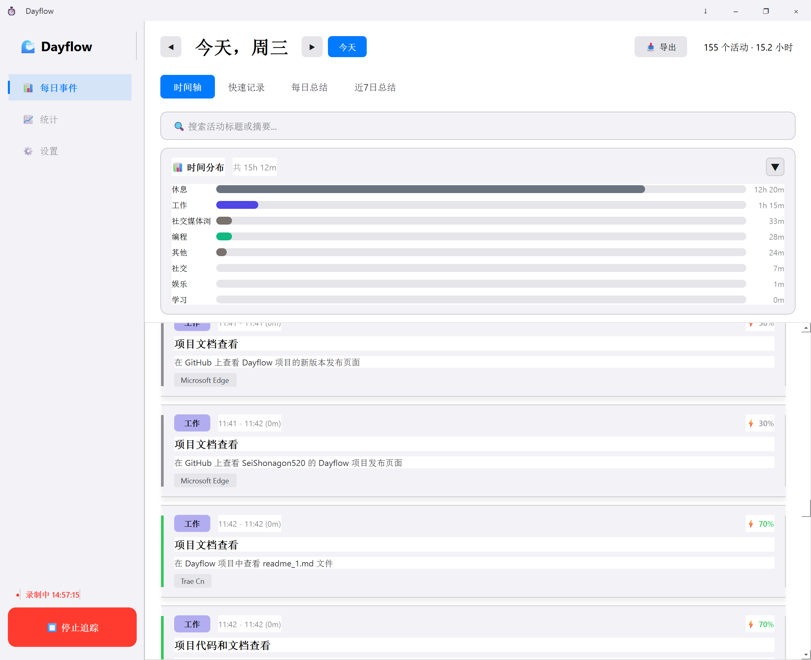
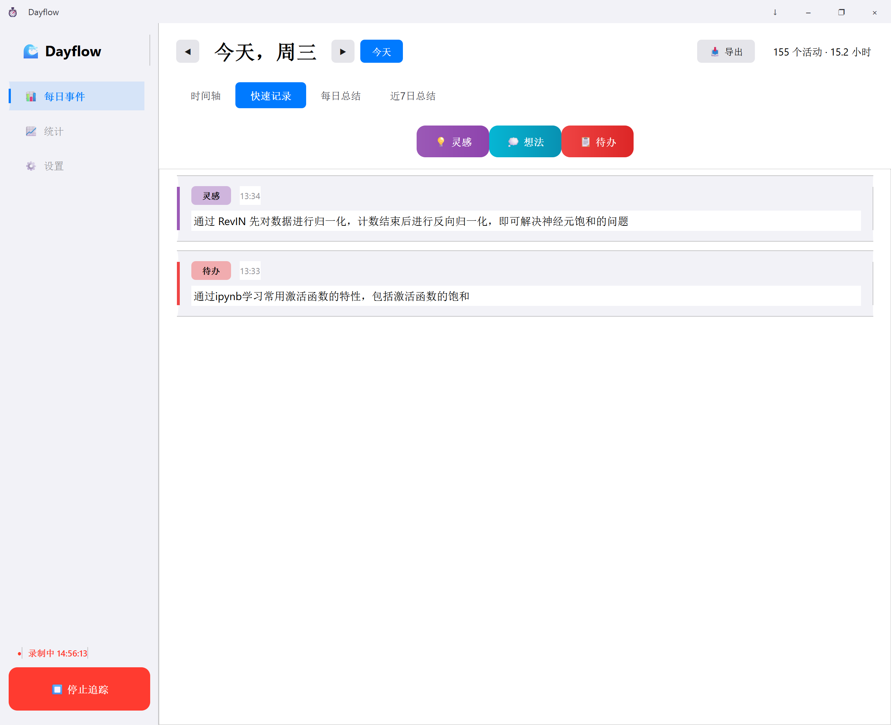
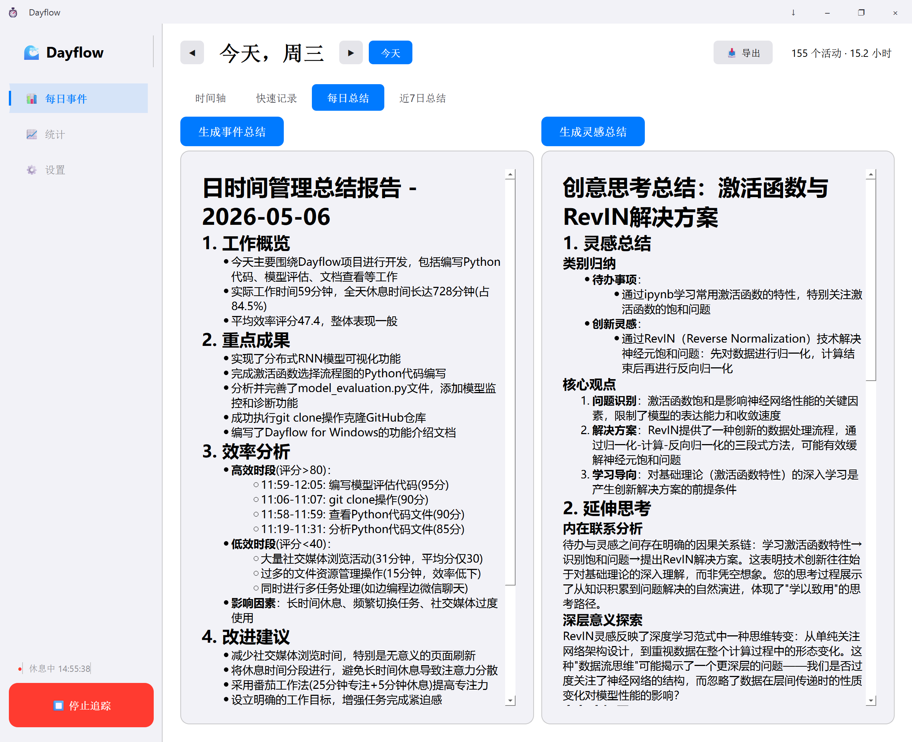
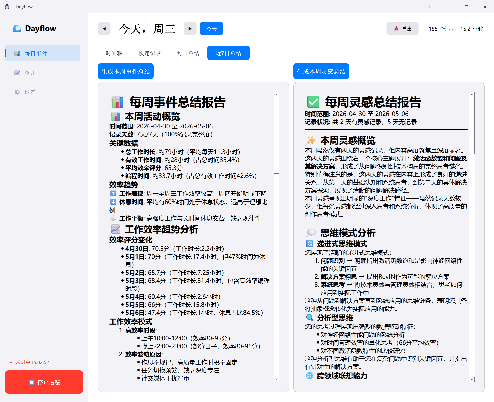
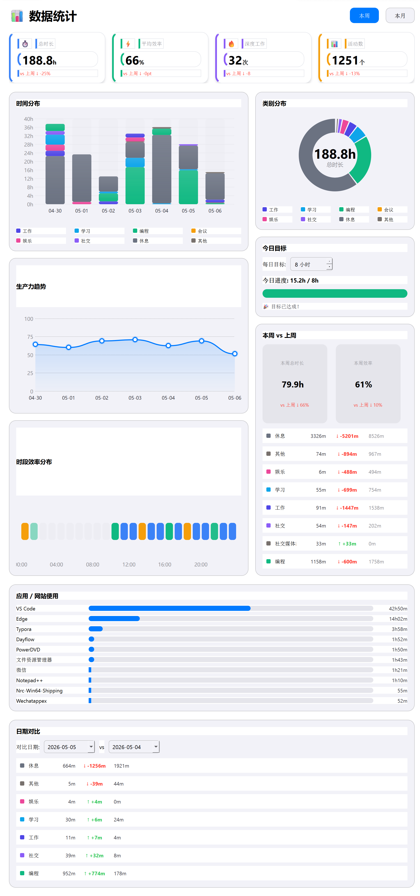
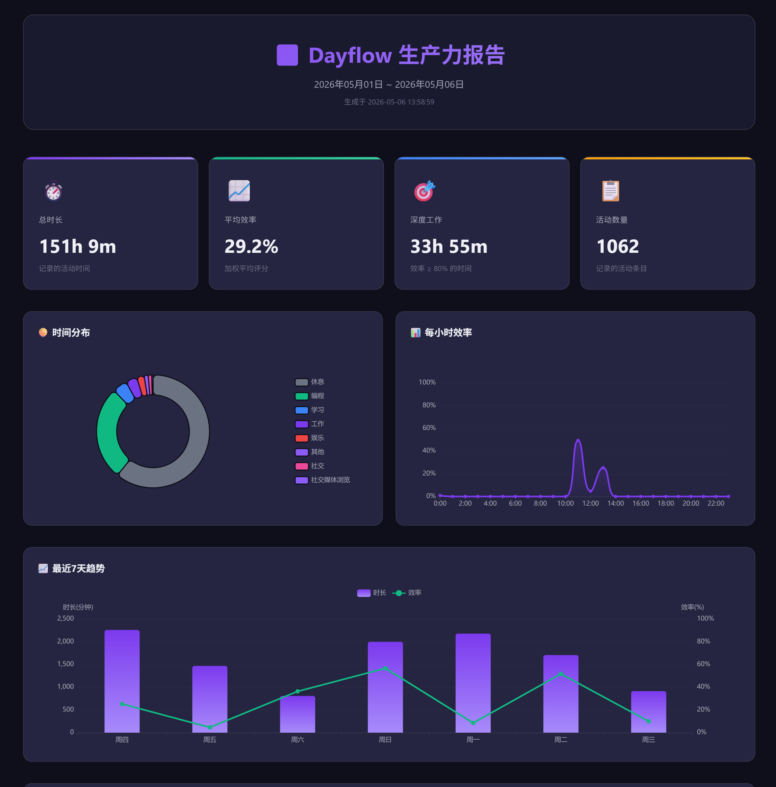
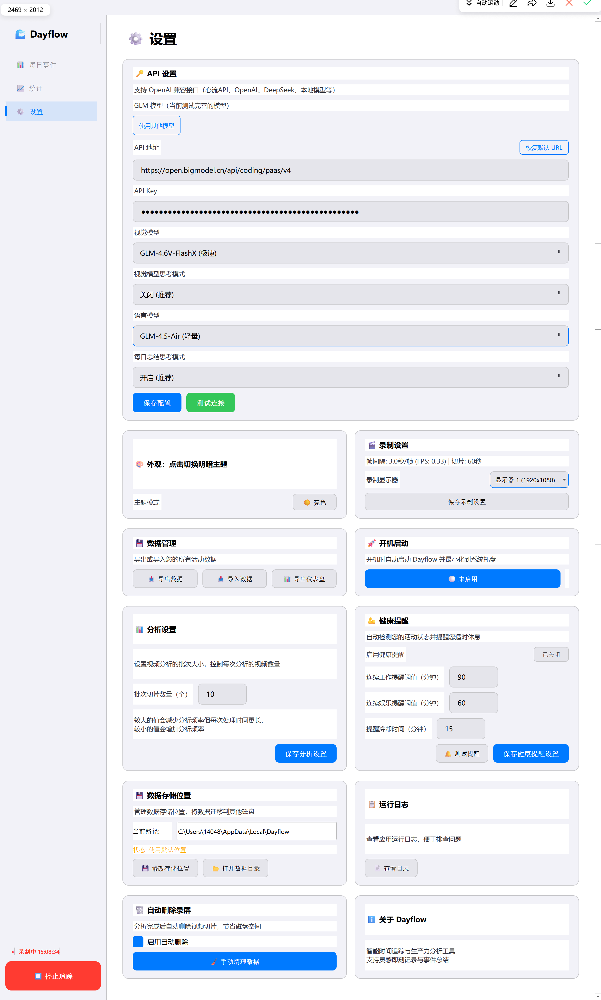
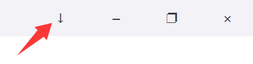

<div align="center">

# ⏱️ Dayflow for Windows

**AI 驱动的智能时间追踪与生产力分析工具**

[GitHub Repository](https://github.com/XYChouMian/Dayflow)

[](https://python.org)
[](https://doc.qt.io/qtforpython/)
[](LICENSE)
[](https://www.microsoft.com/windows)

*后台静默录屏 → AI 智能分析 → 可视化时间轴*

[](https://github.com/XYChouMian/Dayflow/releases)

</div>

---

## 🎯 这是什么？

**Dayflow** 是一款面向 Windows 的 AI 时间追踪工具。它在后台低频记录你的屏幕与窗口信息，通过视觉模型分析你正在做什么，并生成清晰的时间轴、统计面板与日报，帮你更客观地理解时间都花在了哪里。

### 💡 适合谁？

- 想知道自己一天时间到底花在哪的人
- 想复盘专注时段、分心模式、工作节奏的人
- 需要自动活动记录、日报、周报素材的人
- 希望用更低打扰方式做时间追踪的人
- 需要快速记录灵感和想法的人

### 🏆 核心优势

| 优势 | 说明 |
|------|------|
| **零操作** | 开启即用，无需手动打卡，AI 自动分析活动 |
| **超低功耗** | 低频录制 + 智能压缩，尽量降低后台占用 |
| **本地优先** | 原始录屏数据保留在本机，分析后自动清理切片 |
| **智能分类** | 自动识别工作 / 学习 / 娱乐 / 社交 / 休息等活动 |
| **智能闲置检测** | 区分思考和真正的闲置，自动暂停/恢复录制 |
| **可视化复盘** | 时间轴、统计页、Web 仪表盘多种方式查看结果 |
| **灵感记录** | 快速记录想法和灵感，生成日报素材 |

---

## 🔐 隐私说明（重要）

Dayflow 的设计原则是：**本地录制 + 云端分析 + 本地存储**。

### 你需要知道的 5 件事

1. **不会上传完整视频**  
   原始录屏切片保存在本地，不会整段上传到云端。

2. **仅发送有限关键帧用于分析**  
   程序会从切片中提取少量关键帧发送给你配置的视觉模型服务进行分析。

3. **分析结果保存在本地**  
   活动记录、灵感卡片、设置项、统计数据保存在本地 SQLite 数据库中。

4. **录屏切片会自动清理**  
   分析完成后，临时视频切片会自动删除，避免长期占用磁盘。也可以手动清理历史录屏文件。

5. **敏感内容可以手动暂停**  
   遇到密码、银行、隐私聊天等敏感场景时，可以随时点击暂停录制。

### 数据存储位置

```text
%LOCALAPPDATA%\Dayflow\  或自定义路径
├── dayflow.db      # 活动记录、灵感卡片、设置、统计数据
├── dayflow.log     # 运行日志
├── chunks\         # 临时视频切片（分析后自动删除）
└── updates\        # 更新文件缓存
```

> 💡 如果你对隐私非常敏感，建议先阅读本节，再决定是否开启持续录制。

---

## ✨ 主要功能

| 功能 | 描述 |
|------|------|
| 🎥 **低功耗录屏** | 低频录制，后台静默运行，智能压缩节省空间 |
| 🪟 **窗口追踪** | 使用 Windows API 采集真实应用名称和窗口标题 |
| 🤖 **AI 智能分析** | 视觉大模型识别屏幕活动，自动归类，评估效率 |
| 🧠 **智能闲置检测** | 多维度检测，区分思考和真正的闲置，自动暂停/恢复 |
| 📊 **时间轴可视化** | 直观展示每日活动卡片，支持编辑和删除 |
| 📈 **统计面板** | 查看时间分布、效率趋势、周对比等数据 |
| 🌐 **Web 仪表盘** | 导出精美 HTML 报告，支持交互式图表和热力图 |
| 💡 **灵感记录** | 快速记录想法和灵感，支持分类和标签 |
| 📝 **AI 每日/周总结** | 自动生成日报和周报，包含活动分析和改进建议 |
| 🔄 **自动更新** | 检查新版本、后台多源下载、一键安装 |
| 🚀 **开机自启动** | 开机自动运行并最小化到系统托盘 |
| 💾 **数据管理** | 支持导出/导入数据、自定义存储位置、手动清理 |
| ⏸️ **智能暂停** | 检测到用户长时间闲置时自动暂停录制 |
| 🎨 **主题切换** | 支持暗色 / 亮色主题，自动保存偏好 |
| 🔔 **健康提醒** | 工作和娱乐时长提醒，关注工作健康 |

---

## 🖥️ 界面预览

### 每日事件视图

*一站式查看每日活动，包含时间轴、灵感记录、每日总结、周总结四个选项卡，便捷切换。*

#### 时间轴选项卡

*展示每日活动卡片，包含时间段、应用程序、活动摘要和生产力评分。支持编辑和删除卡片。*



#### 灵感记录选项卡

*快速记录想法和灵感，支持分类（灵感/想法/待办）和备注标签。记录的灵感可作为每日总结的素材。*



#### 每日总结选项卡

*AI 自动生成的每日活动分析，包含关键活动、效率变化、改进建议。支持手动编辑和补充内容。*



#### 周总结选项卡

*AI 生成的近 7 日周总结，汇总一周的活动模式和效率变化，提供周维度改进建议。*



#### 统计面板

*仪表盘风格设计，包含指标卡片、类别分布、趋势图、热力图、周对比等多维度数据分析。*



#### Web 仪表盘导出

*导出精美的 HTML 交互式报告，可在浏览器中查看，包含完整的图表和数据可视化。*



#### 设置 - API 配置/健康提醒/活跃度监测/录制配置/数据管理

*配置 API 地址、密钥、模型名称，支持测试连接验证配置。*

*自定义健康提醒规则，包括工作时长阈值、娱乐时长阈值、冷却时间等参数。*

*配置智能闲置检测参数，包括停止检测、恢复检测、思考窗口等，让系统更智能地识别真实闲置。*

*配置录制参数，包括自动暂停开关、切片时长、自动删除录屏等。*

*支持导出/导入数据、修改存储位置、手动清理录屏文件，完全掌控你的数据。*



#### 系统托盘

*最小化到托盘不占用任务栏，右键菜单快速控制录制、显示窗口、退出应用。*




---

## 🚀 快速开始

### 环境要求

- Windows 10 / 11 (64-bit)
- Python 3.10+
- [FFmpeg](https://ffmpeg.org/download.html)（加入系统 PATH）

### 安装步骤

```bash
# 1. 克隆项目
git clone https://github.com/XYChouMian/Dayflow.git
cd Dayflow

# 2. 创建 Conda 环境（推荐）
conda create -n dayflow python=3.11 -y
conda activate dayflow

# 3. 安装依赖
pip install -r requirements.txt

# 4. 启动应用
python main.py
```

### 打包为 EXE（可选）

```bash
# 安装打包工具
pip install pyinstaller

# 运行打包脚本
python build.py

# 或直接双击 build.bat
```

打包完成后，`dist/Dayflow/` 目录可以直接复制给其他人使用。

### 下载预编译版本

如果你只是想直接使用，不想自己配置 Python 环境：

1. 打开 [Releases](https://github.com/XYChouMian/Dayflow/releases)
2. 下载最新版本安装包或压缩包
3. 解压后运行 `Dayflow.exe`

> 💡 首次运行建议先完成 API 配置，再开始录制。

---

## 📖 使用指南

### 1️⃣ 配置 API

1. 打开应用，点击左侧 **⚙️ 设置**
2. 配置以下信息：
   - **API 地址**：智谱 AI 接口地址（默认：https://open.bigmodel.cn/api/paas/v4）
   - **API 地址**：智谱AI Coding Plan： https://open.bigmodel.cn/api/coding/paas/v4
   - **API Key**：你的 API 密钥
   - **模型名称**：需支持视觉的模型（默认：glm-4-flash-250414）
3. 点击 **测试连接** 验证
4. 点击 **保存配置**

> 💡 支持任意 OpenAI 兼容接口：OpenAI、DeepSeek、智谱AI、本地模型（Ollama）等。

### 2️⃣ 开始录制

1. 点击 **▶ 开始录制**
2. 程序在后台静默录屏
3. 每 60 秒生成一个视频切片
4. 定时扫描待分析视频并发送关键帧到配置的模型服务进行分析

### 3️⃣ 查看时间轴

- 分析结果自动显示在首页时间轴
- 每张卡片代表一段活动时间
- 包含活动类别、应用程序、活动摘要、生产力评分等信息
- 支持点击卡片编辑或删除

### 4️⃣ 记录灵感

1. 点击 **快速记录** 选项卡
2. 点击 **+ 添加灵感** 按钮
3. 填写灵感内容、类别（灵感/想法/待办）、备注
4. 保存后可在每日总结中使用

### 5️⃣ 查看总结

- **每日总结**：AI 生成的当日活动分析，包含关键活动、效率变化、改进建议
- **近7日总结**：AI 生成的周总结，汇总一周的活动模式和效率变化
- 支持手动编辑和补充总结内容

### 6️⃣ 导出仪表盘

1. 点击 **时间轴** 或 **统计** 选项卡
2. 点击 **📊 导出仪表盘** 按钮
3. 选择日期范围
4. 导出的 HTML 报告可在浏览器中查看

### 7️⃣ 开机自启动（可选）

1. 打开 **设置** → **开机启动**
2. 点击按钮启用 / 禁用
3. 启用后开机自动运行并最小化到托盘

### 8️⃣ 检查更新（可选）

1. 打开 **设置** → **软件更新**
2. 点击 **检查更新**
3. 发现新版本后点击 **下载更新**
4. 下载完成后点击 **立即安装**

### 9️⃣ 系统托盘

- 点击标题栏 ↓ 按钮 → 最小化到托盘
- 点击关闭 × → 询问退出或最小化
- 双击托盘图标 → 打开主窗口
- 右键托盘 → 控制录制 / 显示窗口 / 退出

---

## 📁 项目结构

```text
Dayflow/
├── main.py                 # 启动入口（支持 --minimized 参数）
├── config.py               # 配置文件（含版本号）
├── requirements.txt        # 依赖清单
├── build.py                # EXE 打包脚本
├── build.bat               # 一键打包批处理
├── updater.py              # 独立更新程序
│
├── core/                   # 核心逻辑
│   ├── types.py
│   ├── recorder.py         # 屏幕录制 (dxcam)
│   ├── window_tracker.py   # 窗口追踪 (Windows API)
│   ├── llm_provider.py     # AI API 交互 + 每日/周总结生成
│   ├── analysis.py         # 分析调度器
│   ├── activity_monitor.py # 活跃度监测（基础）
│   ├── activity_monitor_v2.py # 智能活跃度监测（多维度）
│   ├── health_reminder.py  # 健康提醒系统
│   ├── updater.py          # 版本检查 + 多源下载
│   ├── autostart.py        # 开机自启动管理
│   ├── config_manager.py   # 配置集中管理
│   ├── log_manager.py      # 日志轮转管理
│   ├── stats_collector.py  # 统计数据收集器
│   ├── dashboard_exporter.py # Web 仪表盘导出
│   └── data_migration.py   # 数据迁移管理
│
├── database/               # 数据层
│   ├── schema.sql          # 表结构定义
│   ├── storage.py          # SQLite 管理
│   └── connection_pool.py  # 数据库连接池
│
├── ui/                     # 界面层
│   ├── main_window.py      # 主窗口 + 设置面板
│   ├── timeline_view.py    # 时间轴组件
│   ├── daily_event_view.py # 每日事件视图（时间轴/灵感/总结）
│   ├── inspiration_view.py # 灵感记录组件
│   ├── stats_view.py       # 统计面板
│   ├── date_range_dialog.py # 日期范围选择对话框
│   └── themes.py           # 主题管理
│
├── templates/              # HTML 模板
│   └── dashboard.html      # Web 仪表盘模板
│
└── assets/                 # 资源文件
    └── icon.ico            # 应用图标
```

---

## ⚙️ 配置选项

### 环境变量

| 变量名 | 说明 | 默认值 |
|--------|------|--------|
| `DAYFLOW_API_URL` | API 地址 | `https://open.bigmodel.cn/api/paas/v4` |
| `DAYFLOW_API_KEY` | API 密钥 | (空) |
| `DAYFLOW_API_MODEL` | AI 模型 | `glm-4-flash-250414` |

### 核心配置参数

#### 录制配置
| 参数 | 默认值 | 说明 |
|------|--------|------|
| `RECORD_FRAME_INTERVAL` | 3.0 | 每帧间隔秒数（约 0.33 FPS） |
| `CHUNK_DURATION_SECONDS` | 60 | 每 60 秒一个切片 |
| `VIDEO_BITRATE` | 500k | 低码率 |
| `VIDEO_CODEC` | libx264 | 视频编码格式 |

#### 分析配置
| 参数 | 默认值 | 说明 |
|------|--------|------|
| `BATCH_CHUNK_COUNT` | 10 | 每个批次的切片数量 |
| `ANALYSIS_INTERVAL_SECONDS` | 60 | 扫描一次的间隔（秒） |

#### 活跃度监测配置
| 参数 | 默认值 | 说明 |
|------|--------|------|
| `STOP_CHECK_INTERVAL` | 60 | 停止检测间隔（秒） |
| `STOP_DETECTION_DURATION` | 30 | 停止检测持续时间（秒） |
| `RESUME_WAIT_DURATION` | 30 | 恢复等待持续时间（秒） |
| `RESUME_DETECTION_DURATION` | 90 | 恢复检测持续时间（秒） |

#### 健康提醒配置
| 参数 | 默认值 | 说明 |
|------|--------|------|
| `HEALTH_REMINDER_WORK_THRESHOLD` | 90 | 连续工作多少分钟后提醒休息（分钟） |
| `HEALTH_REMINDER_ENTERTAINMENT_THRESHOLD` | 60 | 连续娱乐多少分钟后提醒（分钟） |
| `HEALTH_REMINDER_COOLDOWN` | 15 | 提醒冷却时间（分钟） |
| `HEALTH_REMINDER_CHECK_INTERVAL` | 300000 | 检查间隔（毫秒，5分钟） |

---

## 🛠️ 技术栈

| 组件 | 技术 |
|------|------|
| GUI 框架 | PySide6 (Qt6) |
| 屏幕捕获 | dxcam (DirectX) |
| 视频处理 | OpenCV, FFmpeg |
| 网络请求 | httpx (HTTP/2) |
| 数据存储 | SQLite |
| 活动监测 | pynput, psutil |
| Windows API | pywin32 |
| 模板引擎 | Jinja2 |
| AI 分析 | OpenAI 兼容接口 |

---

## 🗺️ 功能亮点

### 智能化
- **AI 自动分析**：视觉模型自动识别活动类型和效率
- **智能闲置检测**：多维度检测，区分思考和真正的闲置
- **自动卡片生成**：减少手动整理，支持卡片合并
- **AI 总结生成**：自动生成每日总结和周总结

### 自动化
- **零操作录制**：开启即用，自动录制和分析
- **自动清理**：视频切片分析后自动删除，节省空间
- **健康提醒**：自动提醒工作和娱乐时长
- **开机自启**：自动运行，无需手动开启

### 数据安全
- **本地存储**：所有数据保存在本地
- **数据备份**：支持导出为 JSON 格式
- **手动删除**：可删除敏感数据和录屏文件
- **路径自定义**：可自定义数据存储位置

### 用户体验
- **现代化界面**：Windows 11 风格设计
- **主题切换**：暗色/亮色主题一键切换
- **系统托盘**：不占用任务栏，快速访问
- **可视化复盘**：时间轴、统计页、Web 仪表盘

---

## Known Limitations

- 当前仅支持 Windows 10 / 11
- 活动识别质量依赖你配置的视觉模型能力
- 某些应用的窗口标题可能无法稳定获取
- 多显示器场景仍有进一步优化空间，目前只能采集一块显示器
- 若网络或模型服务不稳定，分析时延会受到影响

---

## 🧰 常见问题 / Troubleshooting

### 1. 启动后没有分析结果

可以优先检查：
- API 地址、Key、模型名是否填写正确
- 模型是否支持视觉输入
- 网络是否可以访问你的模型服务
- 日志中是否存在请求失败或超时

### 2. 录屏或窗口识别异常

可以优先检查：
- 是否运行在 Windows 10 / 11 环境
- 是否缺少 FFmpeg
- 是否有安全软件拦截录屏或窗口读取
- 是否处于全屏游戏、远程桌面或特殊渲染场景

### 3. 更新或启动项不生效

可以优先检查：
- 是否在打包后的 EXE 环境中运行
- EXE 路径是否被移动
- 当前系统权限或安全策略是否限制自启动 / 更新流程

### 4. 智能闲置检测不工作

可以优先检查：
- 活跃度监测功能是否已启用
- pynput 是否正确安装
- 是否有其他软件拦截键盘/鼠标监听
- 检测参数是否设置合理

---

## 💡 灵感来源

本项目灵感源于 [Dayflow (macOS)](https://github.com/JerryZLiu/Dayflow) 开源项目。由于原项目仅支持 macOS，因此我基于相同理念开发了这个 Windows 版本，让更多用户能够体验 AI 驱动的智能时间追踪。

感谢原作者的创意和开源精神！🙏

---

## 📄 许可证

[CC BY-NC-SA 4.0](LICENSE) © 2024-2026

本项目采用 **知识共享 署名-非商业性使用-相同方式共享 4.0** 协议。
- ✅ 可自由学习、修改、分享
- ✅ 修改或引用时请注明原作者
- ❌ 禁止商业使用

> ℹ️ 该仓库当前使用的是 CC BY-NC-SA 4.0，而不是常见的软件许可证（如 MIT / Apache-2.0）。如果你计划二次分发或用于商业场景，请先阅读 LICENSE。

---

## ⭐ Star 历史

<a href="https://star-history.com/#XYChouMian/Dayflow&Date">
 <picture>
   <source media="(prefers-color-scheme: dark)" srcset="https://api.star-history.com/svg?repos=XYChouMian/Dayflow&type=Date&theme=dark" />
   <source media="(prefers-color-scheme: light)" srcset="https://api.star-history.com/svg?repos=XYChouMian/Dayflow&type=Date" />
   
 </picture>
</a>

---

<div align="center">

**如果觉得有用，欢迎点个 ⭐ Star！**

</div>
